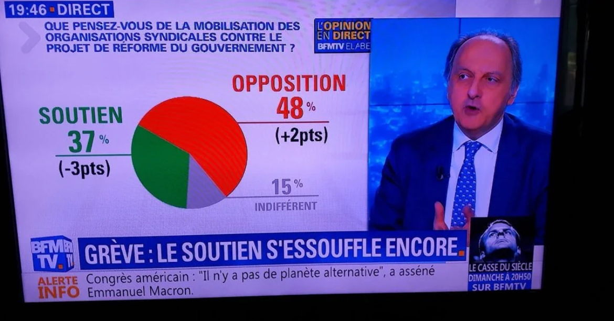
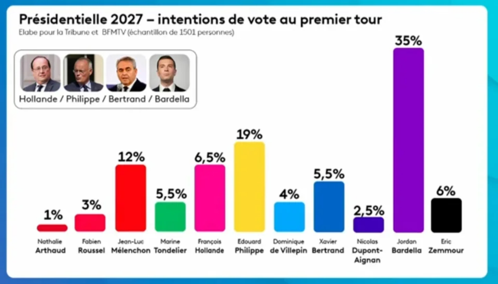
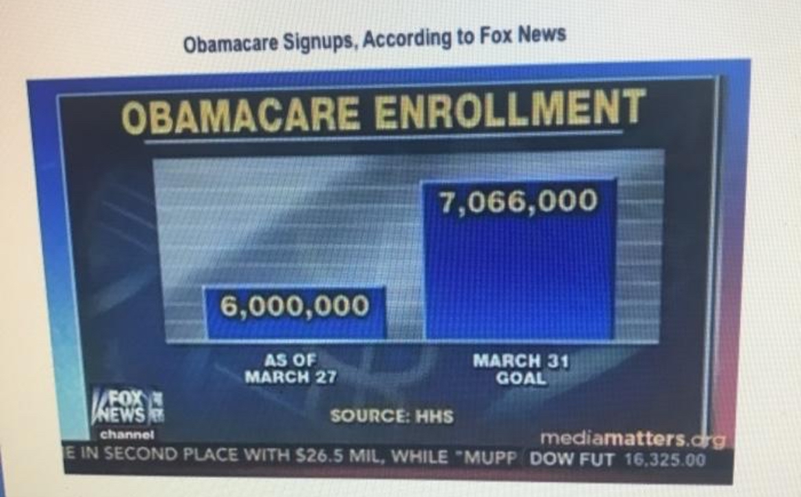

Franceinfo — présidentielle 2027

les valeurs ne sont pas proportionnelles à leur représentation visuelle

Fox News — Obamacare : 6 millions vs 7,066 millions

Le graphique a réellement été diffusé sur Fox News le 31 mars 2014. Les chiffres étaient environ 6 millions contre 7,066 millions, mais la hauteur des barres donnait l'impression d'un écart énorme. Fox News a reconnu l'erreur et diffusé une correction le lendemain.
